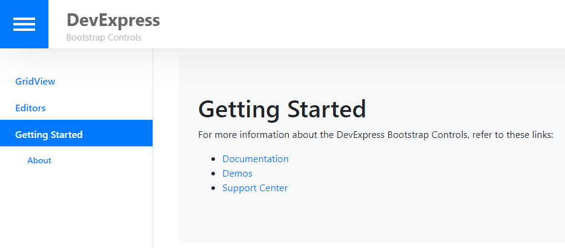

<!-- default badges list -->
[](https://supportcenter.devexpress.com/ticket/details/T605275)
[](https://docs.devexpress.com/GeneralInformation/403183)
<!-- default badges end -->

# Bootstrap Controls for ASP.NET Web Forms - How to implement a responsive side bar
<!-- run online -->
**[[Run Online]](https://codecentral.devexpress.com/t605275/)**
<!-- run online end -->


This example shows how to implement a simplified version of the responsive side bar from our [online Bootstrap demos](https://demos.devexpress.com/bootstrap/).



In the master page ([Site.master](./CS/NavBarResponsive/Shared/Site.master)) add the following references to resources:

```js
<head runat="server">
    <link href="../Content/bootstrap.min.css" rel="stylesheet" />
    // Includes CSS rules for this layout.
    <link href="../Content/navBarLayout.css" rel="stylesheet" />
    <script type="text/javascript" src="Content/jquery.min.js"></script>
    <script type="text/javascript" src="Content/bootstrap.min.js"></script>
    // Contains the required JavaScript code.
    <script type="text/javascript" src="Content/site.js"></script>
    //...
</head>
```

Implement the side bar user control ([SideBar.ascx](./CS/NavBarResponsive/Shared/SideBar.ascx)) based on the DevExpress [BootstrapTreeView](https://demos.devexpress.com/Bootstrap/Navigation/TreeView.aspx) control. Specify the `ID` property (`navTreeView`) and set the `ClientIDMode` property to `Static`. This `ID` is used to apply the CSS classes ([navBarLayout.css](./CS/NavBarResponsive/Content/navBarLayout.css)). 

To collapse the side bar, handle the client-side [BootstrapClientTreeView](https://docs.devexpress.com/AspNetBootstrap/js-BootstrapClientTreeView._members).[NodeClick](https://docs.devexpress.com/AspNet/js-ASPxClientTreeView.NodeClick) event. In the handler, hide the side bar depending on window size. ([site.js](./CS/NavBarResponsive/Content/site.js))

```html
<dx:BootstrapTreeView runat="server" ID="navTreeView" ClientIDMode="Static" ClientInstanceName="navTreeView" ShowExpandButtons="false" >
    <Nodes>
        <dx:BootstrapTreeViewNode Text="GridView" NavigateUrl="~/GridView.aspx" IconCssClass="fas fa-th" />
        <dx:BootstrapTreeViewNode Text="Editors" NavigateUrl="~/Editors.aspx" IconCssClass="fas fa-edit" />
        <dx:BootstrapTreeViewNode Text="Getting Started" NavigateUrl="~/Default.aspx" IconCssClass="fas fa-question" Expanded="true">
            <Nodes>
                <dx:BootstrapTreeViewNode Text="About" NavigateUrl="~/About.aspx" />
            </Nodes>
        </dx:BootstrapTreeViewNode>
    </Nodes>
    <ClientSideEvents ExpandedChanging="preventExpandedChanging" NodeClick="onSideBarNodeClick" />
</dx:BootstrapTreeView>
```

Add the side bar user control in the master page:

```html
<uc:SideBar runat="server" id="SideBar" />
```


## Files to Review

* [Site.master](./CS/NavBarResponsive/Shared/Site.master) (VB: [Site.master](./VB/NavBarResponsive/Shared/Site.master))
* [navBarLayout.css](./CS/NavBarResponsive/Content/navBarLayout.css)
* [site.js](./CS/NavBarResponsive/Content/site.js) (VB: [site.js](./VB/NavBarResponsive/Content/site.js))
* [SideBar.ascx](./CS/NavBarResponsive/Shared/SideBar.ascx) (VB: [SideBar.ascx](./VB/NavBarResponsive/Shared/SideBar.ascx))
